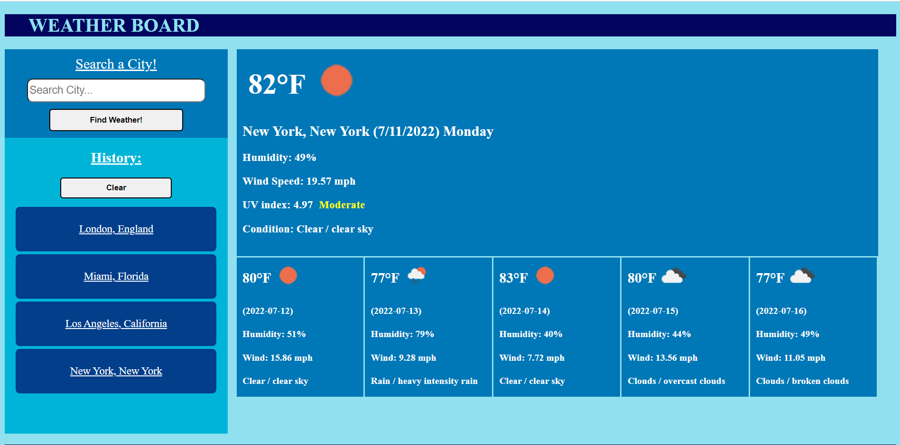

# WeatherBoard-Demo
A webpage displaying the weather outlook of the user's chosen city.

# User Story

AS A traveler
I WANT to see the weather outlook for multiple cities
SO THAT I can plan a trip accordingly

# Acceptance Criteria

**GIVEN** a weather dashboard with form inputs

**WHEN** I search for a city
**THEN** I am presented with current and future conditions for that city and that city is added to the search history.

**WHEN** I view current weather conditions for that city  
**THEN** I am presented with the city name, the date, an icon representation of weather conditions, the temperature, the humidity, the wind speed, and the UV index.

**WHEN** I view the UV index
**THEN** I am presented with a color that indicates whether the conditions are favorable, moderate, or severe.

**WHEN** I view future weather conditions for that city  
**THEN** I am presented with a 5-day forecast that displays the date, an icon representation of weather conditions, the temperature, the wind speed, and the humidity.

**WHEN** I click on a city in the search history
**THEN** I am again presented with current and future conditions for that city.

# Display

# Details

Things learned:

- Utilize third-party API
- Javascript Fetch operations
- Async function and 'Await' operator
- Aware of sensitive information like API keys

The third-party API used in this application was [OpenWeather](https://openweathermap.org/). The website consisted of multiple different APIs but in this application I used the OneCall v2.5 API, 3 hour/5 days Forecast API, and the Geolocation API. Each had it's own nuances in calling the API as well as their individual responses. Learning the Fetch operations, as well as the Async functions and await operators, were big in the sense that this opens up a little on backend server aspect which my cohort and I will be going into soon. In calling API services using the fetch operations I had noticed that my API key was vulnerable to the public once it was on Github. I was able to make sure that the website for the API wasn't going to bill me unnecessarily. Next time there will be different files to store these sensitive information and to securely utilize them. 

Lastly, to note, this is a challenge excercise from the UCR bootcamp program.

# Links

GitHub: [https://github.com/DKhubgit/WeatherBoard-Demo](https://github.com/DKhubgit/WeatherBoard-Demo)

GitHub Pages: [https://dkhubgit.github.io/WeatherBoard-Demo/](https://dkhubgit.github.io/WeatherBoard-Demo/)